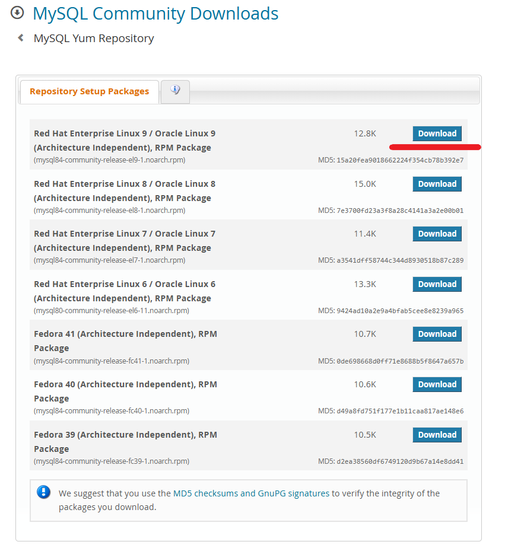

# How to Install MySQL on CentOS Stream 9
MySQL is an open-source relational database management system used to store and manage structured data. It is widely used in web applications, including CMS platforms like WordPress and e-commerce sites. MySQL supports SQL for querying and managing data efficiently. It is known for its reliability, scalability, and compatibility with various operating systems, making it a popular choice for developers and enterprises.
The installation can be done using the MySQL Community Repository or using the CentOS AppStream Repository. The MySQL Community Repository method provides the latest MySQL version with frequent updates and security patches directly from MySQL, while the CentOS AppStream Repository offers an older but more stable version maintained by CentOS. The first method requires manually enabling the MySQL repository but gives more flexibility in choosing versions, whereas the second method is simpler since it uses CentOS’s default repositories.
Next, let’s look at how to install the latest MySQL version on CentOS Stream 9 using the MySQL Community Repository.
## How to Install MySQL on CentOS Stream 9
In the case of installation using the MySQL Community Repository, you must download the required version .rpm file. An .rpm file (Red Hat Package Manager file) is a package format used by RHEL-based Linux distributions, including CentOS, to install, update, and manage software.
To download the .rpm file, navigate to [MySQL Yum Repository page](https://dev.mysql.com/downloads/repo/yum/) and click Download in the Red Hat Enterprise Linux 9 RPM Package section.



Log in or sign up on the next page or click the right mouse button on the `No thanks, just start my download` line and select `Copy link` from the context menu.


Then, download and install the RPM package, which adds the MySQL repository to the system, using the default package manager and the previously copied link:
```
sudo dnf install https://dev.mysql.com/get/mysql84-community-release-el9-1.noarch.rpm
```
In the next step, install the MySQL Server package:
```
sudo dnf install mysql-community-server
```
Continued on the [iolloi.icu](https://iolloi.icu/index.php/2025/03/04/how-to-install-mysql-on-centos-stream-9/)
